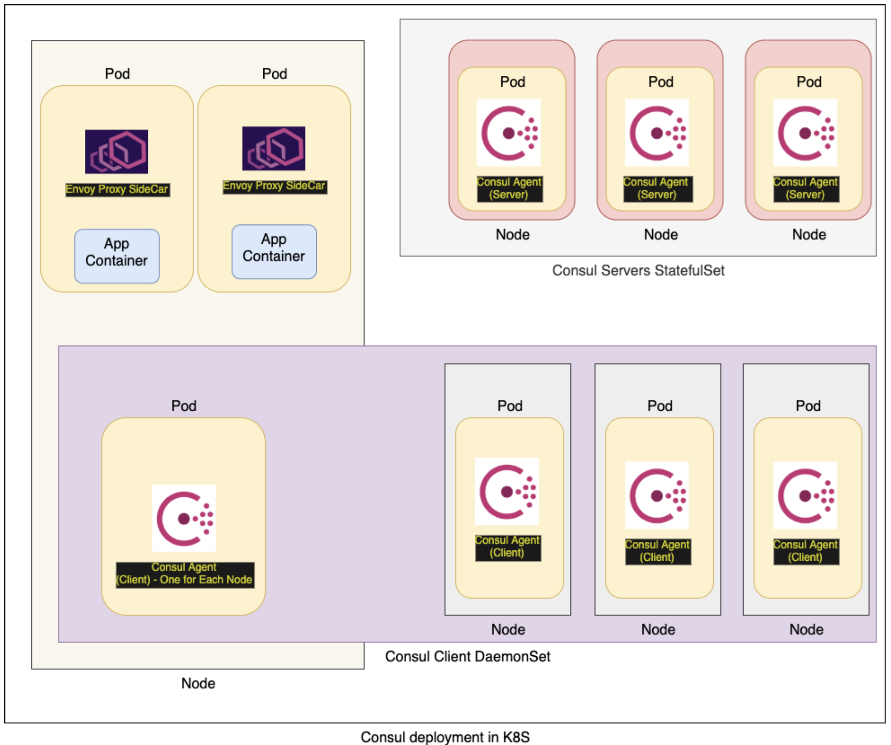

### Deploying a Consul V1.8+ cluster with Ingress Gateways
The easiest way to deploy a Consul Cluster on Kubernetes is to use the [consul-helm project](https://github.com/hashicorp/consul-helm). For this demo, we have included an example values.yaml file for helm and the commands to install Consul with a helm release name consul-k8s. 
```
$ helm repo add hashicorp https://helm.releases.hashicorp.com
$ cd hashicat-docker
$ helm install consul-k8s hashicorp/consul -f helm/consul-k8s.values.yaml
$ kubectl get pods
```
In a few minutes you should have a consul cluster deployed with three healthy consul server pods ending in consul-server-0, consul-server-1 and consul-server-2. Below is a diagram of Consul deployment in Kubernetes.



For more detailed information, please see our learn guide track for [Consul on Kubernetes](https://learn.hashicorp.com/consul?track=kubernetes#kubernetes).
For this demo, we need Consul 1.8 with Ingress Gateways and TLS enabled. This [Ingress Gateways blog post](https://www.hashicorp.com/blog/ingress-gateways-in-hashicorp-consul-1-8/?utm_source=linkedin) contains an example snippet of helm values.yaml file.
Note the following NodePort assignments for Ingress Gateway. We will use these ports to define ingress gateway listeners and access the application.
```
      ports:
        - port: 8080
          nodePort: 32080
        - port: 8180
          nodePort: 32180
```
