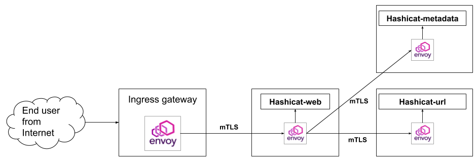

### v3-python-go
HashiCat version 3 uses the same `hashicat-web` frontend as V2, but contains two  individual backend services written in Golang: `hashicat-url` and `hashicat-metadata`.

### Running locally
